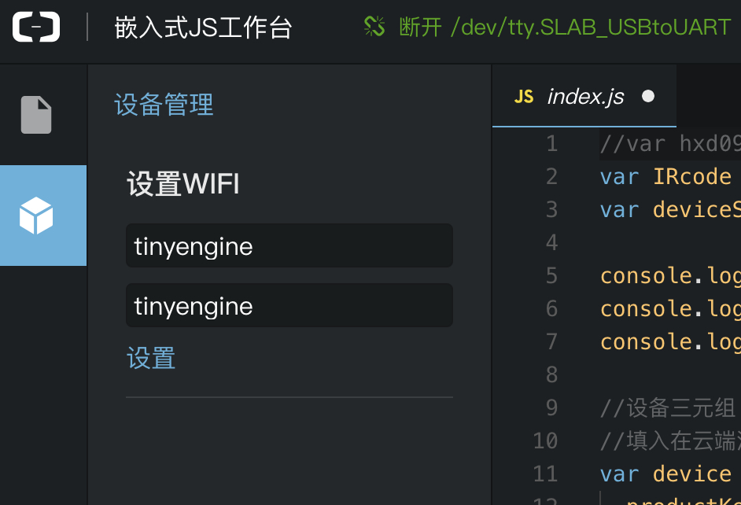

# 常见问题(FAQ)

* 运行应用时，控制台输出 `WARNING: FUNC: at 2:9 current tolken=` 类似错误是什么原因？

  答：通常是由于语法错误或者语法不支持引起的，请根据`tolken=`的提示检查该语法是不是支持，

  详情请查看[TinyEngine编程指南](https://linkdevelop.aliyun.com/device-doc#ebagtb.html)，若使用了本地扩展对象，请参考[JavaScript扩展对象及API使用](https://linkdevelop.aliyun.com/device-doc#ebagtb.html).

  

* 点击嵌入式应用控制台的“运行”按钮，出现一直在“更新中…",是什么原因？

  答：该问题的一种可能原因是：终端设备未升级TinyEngine固件，所以控制台更新失败。

  解决方法是：先升级TinyEngine固件，升级固件的方法，请查看docs中的固件升级文档。

* 如果出现web JS控制台即浏览器与设备连接不上，如何分析处理？

  答：查看设备的端口是否已经枚举出来，be launch是否正常运行，浏览器刷新再重试。

* MAC电脑上找不到ESP32的usb端口？

  答：这可能是MAC上未安装usb转串口的驱动，或者在安装串口驱动时MAC由于权限原因阻止了驱动的载入。

  ESP32安装串口驱动方法：

  - Windwos和MAC：点击该[地址]( https://cn.silabs.com/products/development-tools/software/usb-to-uart-bridge-vcp-drivers)并下载相应系统对应驱动并安装。

  - Ubuntu：无需安装驱动，默认自带。

  - 注意：

    MAC上安装串口驱动时默认会被阻止，需要打开 系统偏好设置->安全与隐私->查看是否有类似“silabs.com”的应用被阻止的情况，如有需要点击允许放行。

* 哪些应用或功能可以在模拟器上调试？

  答：TinyEngine模拟器运行在PC上，所以与硬件控制无关的功能都可以在模拟器上测试，如deviceShadow上云模块，net，http等。

* 是否可以自己移植一款新的支持硬件？

  答：TinyEngine SDK即将开源，届时可以参考SDK移植文档进行新的硬件移植。

  敬请关注github更新[TinyEngine](https://github.com/aliyun/TinyEngine).

  

* 当前可以引入的驱动或模块有哪些？

  答：当前我们基于iot应用场景开发了多款driver和module，包括了多达几十款传感器驱动，如温度传感器，湿度传感器，陀螺仪，加速度传感器等，模块如deviceShadow上云模块，红外学习模块等。

  我们希望更多的开发者能使用上这些驱动和模块，并欢迎开发者能贡献自己开发的驱动或模块。

* 如果实际硬件连接有变化，还能使用导入的这些模块/驱动吗？

  答：可以的，驱动/模块是跟实际硬件连接无关的，决定当前的硬件版型和连接的是board.json文件，该文件中定义每个对象对应的实际管脚号及管脚的用途，所以硬件版型或连接有变化时只需修改board.json文件即可。具体详情请查看文档[board.json配置说明](%E6%9D%BF%E7%BA%A7%E9%85%8D%E7%BD%AE%E6%96%87%E4%BB%B6board.json%E4%BD%BF%E7%94%A8%E8%AF%B4%E6%98%8E.md).

* 使用npm安装be-cli时速度很慢，经常卡住 导致安装be-cli失败怎么解决？

  答：更换npm的源为淘宝源。然后使用`cnpm install be-cli -g`安装。

  参考方法：https://npm.taobao.org/

  

* 如何设置设备的WIFI？

  答：

  方法一：进入嵌入式JS开发控制台，打开一个项目，连接设备，点击左侧图标栏的“设备管理”，输入wifi的ssid和密码，点击设置即可。如下图：

  

​      方法二：使用be 的命令行工具：  be setWiFi <target> <ssid> <password> ,

  说明此处target是串口节点如/dev/ttyUSB0，windows上可能是COMx，mac上可能是dev/tty.SLAB_USBtoUART

​    方法三： 参考TinyEngine JS API文档，使用WIFI.connect(ssid,passwd,function(){});方式连接指定wifi。

 