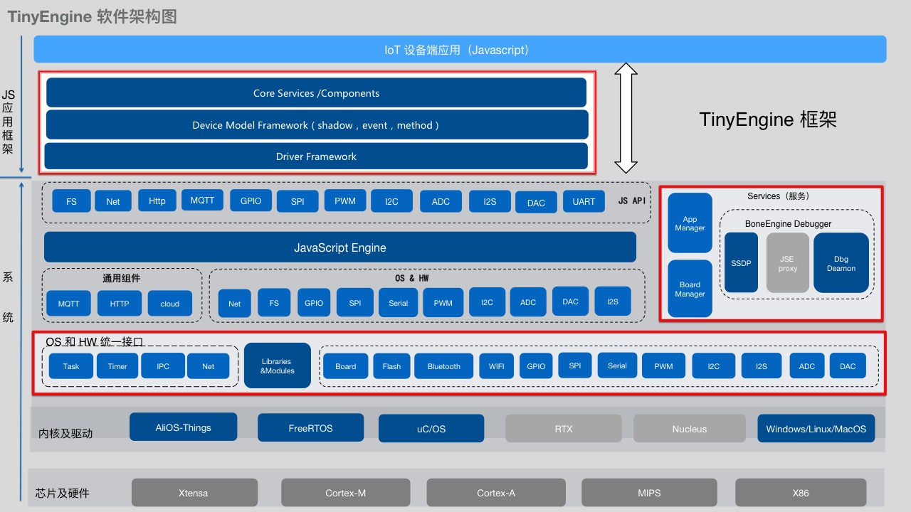
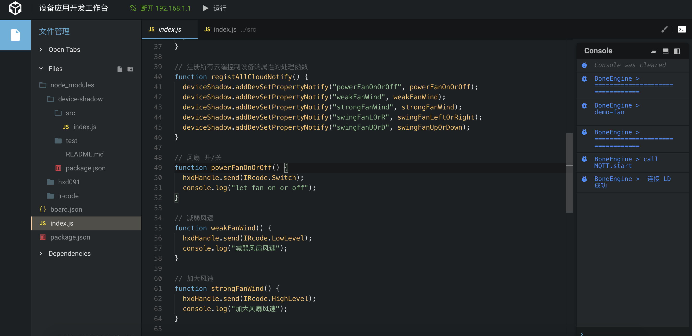

## TinyEngine 系统架构概要
## 概述

TinyEngine 是一个专门为嵌入式设备提供的 Javascript 运行时环境，它提供极轻量级的JSE，设备抽象模型，应用编程框架，以及相关的辅助开发和调试工具。具体包括：


* 多芯片和硬件支持：

	支持大多数主流嵌入式的MCU和SoC，包括乐鑫 ESP8266，ESP32，庆科 MK3060，MK3080，STMicro 的 STM32F1xx,STM32F4xx,STM32F7xx 系列
* 应用编程框架：

	提供丰富的硬件，文件系统，网络等扩展对象和API，可直接连接阿里的LinkDevelop LinkPlatform IoT云平台，内置应用管理组件，支持多应用分发和OTA升级
* 设备驱动模型：

	抽象硬件驱动模型，可以用Javascript开发硬件驱动程序，还提供大量的IoT相关的设备驱动，包括各种传感器，控制器，以及显示设备
* 集成开发套件：

	针对不同的开发者，官方提供 TinyEngine 系统固件，用户可定制的TinyEngineSDK，以及完全开源的 TinyEngine


	“一份应用，全平台运行” 不用关注硬件设备，就可以开发嵌入式应用。
	

整个TinyEngine软件系统架构图如下：



## 芯片及硬件

TinyEngine 可支持多种不同架构的Soc,CPU,MCU:

* 芯片模组：
    * 乐鑫ESP32，ESP8266，
    * 庆科EMW3060，EMW3080，
    * STMicroelectronics的STM32xx等模组芯片；
* 可以运行在IA32/IA64 PC上，用于调试或开发的仿真器；
* 也可以运行在边缘 Linux 网关（MIPS），树莓派（ARM）等资源丰富的设备上。

## 内核及驱动

TinyEngine 目前可以运行在多种嵌入式设备的RTOS内核上:

* AliOS Things
* FreeRTOS
* UCOS-II

TinyEngine 同时还提供了虚拟设备，可运行在Windows，Linux，MacOS等Host主机上，做为调试器使用。

## 系统及硬件抽象层

TinyEngine 为支持跨平台，跨操作系统能力，针对不同操作系统，Soc芯片和硬件，统一封装抽象接口，这样客户在应用或产品切换到不同平台时，上层应用不用替换，从而可以保证快速移植和产品化，也能达到“一份代码，处处运行”的目标。

OSAL（系统抽象层）将 TinyEngine 所需的与操作系统的相关函数进行封装。 目前 TinyEngine 主要需要内核提供任务调度，定时器，进程间通讯等基本功能，由于不同的RTOS函数接口不一致，因此系统抽象层将完成操作系统函数的统一。

硬件抽象层则统一不同平台的硬件驱动接口。针对不同平台提供的外部硬件接口，对接硬件接口或者驱动实现统一封装，供TinyEngine的Native eXtension Modules 如 HW 模块调用。 目前 TinyEngine 支持的硬件模块包括:

* GPIO
* I2C
* I2S
* ADC
* PWM
* UART
* SPI
* Board
* WIFI
* Bluetooth
* Flash

## <a name="fuouwd"></a>TinyEngine 应用编程框架

应用编程框架是 TinyEngine 最主要部分，既包括JS应用的运行环境，也包含了大量的扩展模块，扩展模块通过API的方式暴露给JS应用开发者调用。框架的目的在于：一方面隔离应用对底层硬件和操作系统的依赖，一方面封装大量的扩展接口，方便让开发者在JS层调用，另外，扩展模块由Native C实现，可以提高性能，整个框架包括 :

* Javascript 引擎（TinyEngine）
* 硬件内置扩展模块： GPIO，I2S，I2C，ADC，PWM，SPI，WIFI，Flash
* IoT相关服务，组件的本地扩展模块： 如 MQTT，HTTP，CoAP
* 服务
    * AppManager 应用管理
    * BoardManager 板级配置管理
    * debugger 设备调试
* 应用组件
    * 标准设备模型：阿里标准设备模型，包括设备三要素（属性，事件，方法）
    * 硬件驱动框架：应用程调用硬件驱动框架，开发者可以基于驱动框架，用Javascript 开发驱动程序
    * Cloud-client ：通过MQTT和阿里 Link Developer（ LD ） 平台连接

### <a name="s1apst"></a>OS 抽象及硬件设备抽象

OSAL 与硬件抽象层的目的是：

* 隔离 TinyEngine 与底层 OS 系统的依赖，便于跨OS移植
* 隔离 TinyEngine 与底层硬件平台依赖，便于跨芯片移植

数据接口定义：

* 任务(task)：create,destroy，delay
* 事件（event)：post,register
* 定时器（timer) post,register
* 硬件 IO： 

### 应用管理 AppManager AppManager管理应用的安装，下载，运行. 

在 TinyEngine 中，为了便于JS应用程序的安全存储，分发和管理，对应用程序打成APP-PACK，该包中，包含了文件应用程序的文件列表，版本，包签名证书等信息。在云端和本地开发环境包含了打包和拆包工具，可以把整个JS程序，board.json 配置文件以及其他库文件打包成整个应用包。

例如：一个普通 TinyEngine 应用程序可以如下几个文件组成：

``` .
.
├── board.json
├── index.js
├── node_modules
│   ├── IRcode
│   │   ├── package.json
│   │   └── src
│   └── hxd019
│       ├── package.json
│       ├── readme.md
│       ├── src
│       └── test
└── package.json
```

具体说明：

```
index.js
   JS应用程序执行入口
board.js
   板级的端口配置文件
node_modules
   包含驱动，软件模块的目录
package.json
   整个应用的包配置文件
```

### 板级配置管理 BoardManager

板级配置管理服务主要负责：

* 动态配置板级的管脚，端口映射
* 生成 TinyEngine 的静态HW全局JS对象
* 管理板级硬件资源初始化，资源分配以及释放

智能小车板级配置 board.json 文件如下：

```
{
  "a4950.left0":{
    "type":"PWM",
    "port":0,
    "chan":5,
    "freq":1000,
    "duty":0
  },
  "a4950.left1":{
    "type":"PWM",
    "port":0,
    "chan":17,
    "freq":1000,
    "duty":0
  },
  "a4950.right0":{
    "type":"PWM",
    "port":0,
    "chan":4,
    "freq":1000,
    "duty":0
  },
  "a4950.right1":{
    "type":"PWM",
    "port":0,
    "chan":16,
    "freq":1000,
    "duty":0
  },
  "ds3119":{
    "type":"PWM",
    "port":1,
    "chan":15,
    "freq":50,
    "duty":0
  },
  "battery":{
    "type":"ADC",
    "port":1,
    "chan":34,
    "sampling":12000000
  },
  "encoder.left0":{
    "type":"GPIO",
    "port":26,
    "dir":2,
    "pull":1
  },
  "encoder.left1":{
    "type":"GPIO",
    "port":27,
    "dir":1,
    "pull":1
  },
  "encoder.right0":{
    "type":"GPIO",
    "port":13,
    "dir":2,
    "pull":1
  },
  "encoder.right1":{
    "type":"GPIO",
    "port":14,
    "dir":1,
    "pull":1
  }
}
```

board.json 配置文件可以和APP-PACK一起下发，也可以在出厂时直接烧写，如果系统没有该配置文件，使用缺省映射。


## Javascript 引擎

Javascript 引擎专门为资源有限的设备提供的轻量级的 Javascript 引擎，相对于V8，SpideMonkey 功能强大的JS引擎，TinyEngine 不支持JIT功能，但是对JS语法集支持做了精简，而针对IoT特定需求，对硬件驱动，操作系统函数，以及MQTT，MESH等功能模块实现了JS语法扩展，开发者可以直接通过JS API调用这些功能模块

目前，TinyEngine支持两个版本：mini-JSE，full-JSE（ES5.1）

TinyEngine@mini-JSE 具有如下特点：

* 资源占用：RAM<15KB,ROM(Footprint) <15KB
* CPU性能：优化的词法和句法分析器，降低CPU使用率
* JS 支持能力：面向IOT的 ES 精简语法 ，CommonJS 支持，IoT 内置模块

## IDE 开发工具
   为了便于开发者开发和调试 TinyEngine 应用和产品，TinyEngine还提供了图形化的开发工具，目前，支持WebIDE和 App模式的 IDE，WebIDE可以直接在阿里的IOT 开发者平台直接进入( ld.aliyun.com )
   

还提供了本地的App IDE开发工具，开发者可以从tools目录下下载使用，该工具也会开源给开发者



IDE工具支持串口和网络方式与调试的目标设备相连，目前，IDE开发工具支持应用代码编辑，模块和驱动导入，应用程序的打包和下载到设备，支持设备的日志输出，以及 TinyEngine 的 Javascript Shell 功能。

	
	

