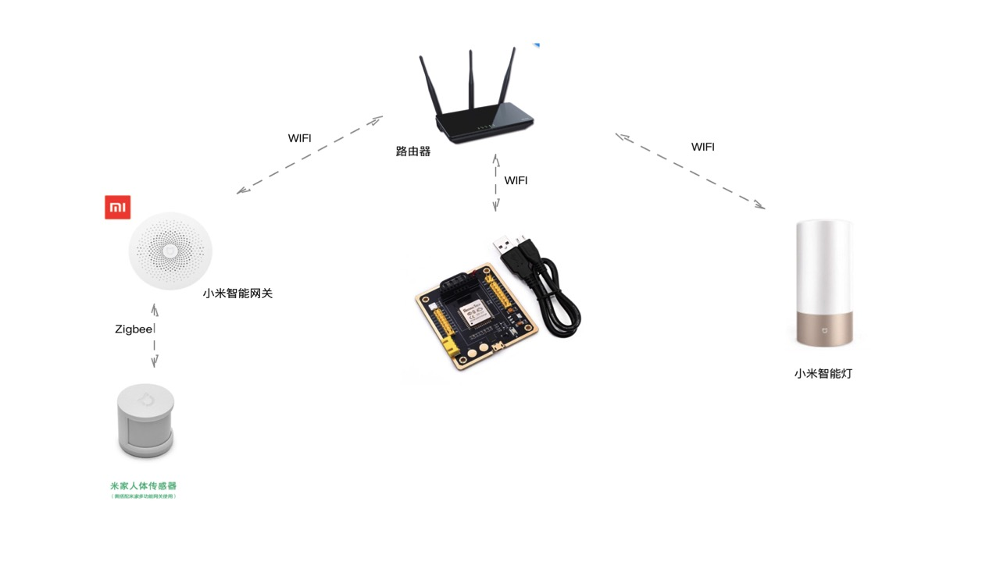
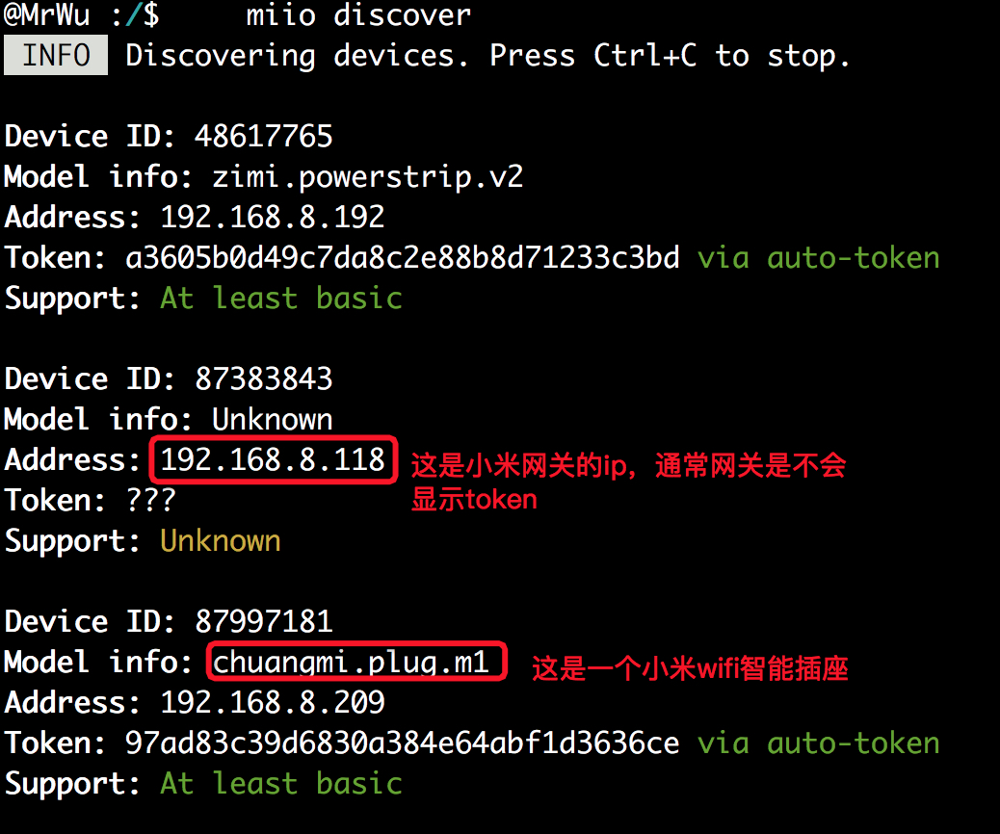
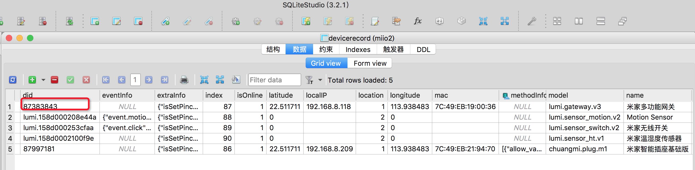
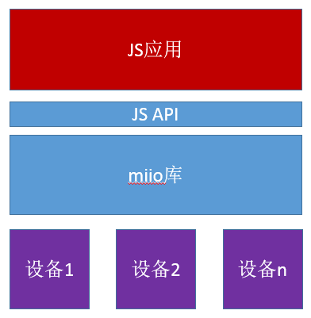

# miio 小米设备接入

TinyEngine支持小米设备接入，在TinyEngine的Native层，实现了小米设备miio通信协议，同时向上提供了JS接口。Native miio 库实现数据传输通道（包括会话建立、加密发送数据、解密接收数据等）和事件转发，具体的设备模型（属性、接口、事件）在JS应用层可见。同时我们提供了一个小米设备的场景示例，通过小米网关+小米人体感应器+小米智能灯泡实现自动监测人经过开关灯的功能，示例代码的地址在github[链接](https://github.com/aliyun/TinyEngine/tree/master/scripts/demos/demo-miio-scene)。

## 使用方法

- 打开嵌入式JS控制台，新建一个项目；地址[链接](https://linkdevelop.aliyun.com/deviceapp#/s)

- 复制github上[链接](https://github.com/aliyun/TinyEngine/tree/master/scripts/demos/demo-miio-scene) demo-miio-scene/index.js中的内容到 嵌入式控制台的默认js入口文件index.js中。

- 配置ESP32连接的WIFI网络 和 小米网关的WIFI网络， 二者需连接到同一个WIFI局域网内。

  - ESP32的WIFI配置方法： 连接ESP32的usb口到PC，然后打开嵌入式JS控制台，点击连接按钮连接设备，然后点击的设备管理-》WIFI设置，输入wifi的用户名密码，点击设置即可。

  

  - 小米网关的WIFI网络配置方法： 使用米家app 配置小米网关的WIFI网络，请参考说明书或者网上的文档使用米家APP应用配置小米网关连接到一个WIFI热点上，此过程比较简单，米家APP上有提示。

  

  - 通过米家APP添加小米网关的子设备，例程这里是米家人体红外传感器和小米智能灯泡。这样小米网关、人体传感器、小米智能灯泡、ESP32模组就组成了一个如图所示的控制系统了。

  

  

  - 下一步，我们需要获取小米网关、人体传感器、小米灯泡的设备ID(deviceID)，设备身份标识(token)，这里的token是小米miio通信协议中用于识别小米设备的身份标识，由于小米官方并不提供开放协议获取token，目前大家常用的做法是通过miio npm工具和查看android手机数据库的方法。具体方法请参考下面的章节《如何获取小米设备的deviceID和token》。

  - 获取到上述这些deviceID和token后，修改index.js程序中的对应设备的ID(deviceID)和设备身份标识(token)进行相应的场景调试。

  ```
  // miio 为 Natvie Modules，按照小米设备接入协议实现的扩展对象
  // 如下设备的Did，token需要填入真实设备的信息，具体获取方法请参考README
  var lightDevice;
  var xiaoMiMotionSentorDid = 'xxx';  //小米人体感应器的deviceID
  var xiaoMiGatewayDid = xxx;   //小米网关的deviceID
  var xiaoMiLightDid = xxx;   //小米WIFI灯的deviceID
  var xiaoMiGatewayToken = "xxx";  //小米网关的Token
  var xiaoMiLightToken = "xxx";  //小米WIFI灯的Token
  var WiFiSSID = 'xxx'; //小米设备连接的WiFi热点名称
  var WiFiPasswd = 'xxxx'; //小米设备连接的WiFi热点密码
  ```

  **注意**：本例程中的控制接口和参数，如 灯的控制接口set_power，人体传感器的移动事件状态motion都是针对某一款小米设备的，对于新接入的小米设备，需要参考下面的《如何查看小米设备的miio接口和属性》。

## 认识小米设备

小米设备主要有两类，一类是wifi设备，即直接可以通过wifi就可以连接到局域网，一类是zigbee子设备（如本例中的小米人体红外传感器），这类设备必须通过小米网关才能接入到局域网中，所以要想控制，查看zigbee子设备，必须通过米家APP将zigbee子设备接入到小米网关才行。在下面的章节中，将不再赘述zigbee子设备是需要通过小米网关接入查看和控制这个前提。

## 如何获取小米设备的deviceid和token？

- 方法一：通过npm工具命令：`miio discover `查看。

具体步骤请查考github的文档：<https://github.com/aholstenson/miio/blob/master/docs/management.md>

使用该方法注意：PC需要跟小米设备连接在同一个WIFI局域网络。且小米网关的zigbee子设备很可能通过该方法获取不到，这时可以尝试方法二。

如图是一个示例：




- 方法二：

另一种方法是在root过的android手机（或者在android虚拟机上）安装低版本的米家app（比如：5.0.15），

说明： MAC系统推荐使用网易MuMu模拟器：[链接](http://mumu.163.com/)。 

米家app低版本链接如下：

[com.xiaomi.smarthome 2.apk.zip](https://yuque.antfin-inc.com/attachments/lark/0/2018/zip/89215/1538134545968-d26c929d-5c67-48f1-9a50-57931f027620.zip)(17.39 MB)

登录米家app，然后通过米家app添加网关及小米设备，**并进行相应的触发操作**，如触发人体感应，控制开关灯等。然后查询`/data/data/com.xiaomi.smarthome/databases/miio2.db`数据库。然后使用可视化的sqlite3工具打开这个数据库找到对应设备的信息。

例如：在我的mac电脑的网易MuMu模拟器上的操作步骤如下：

```
@MrWu :~$     adb devices
List of devices attached
127.0.0.1:5555	offline
emulator-5554	device

@MrWu :~$     adb -s emulator-5554 pull /data/data/com.xiaomi.smarthome/databases/miio2.db .
/data/data/com.xiaomi.smarthome/databases/miio2.db: 1 file pulled. 3.5 MB/s (20480 bytes in 0.006s)
```

然后使用mac上的sqlite工具（SQliteStdio免费版）打开该数据库（或者使用sqlite命令  `sqlite3 miio2.db 'select did,name,localIP,token from devicerecord' `）；

如下可以看出，小米设备的各种信息在数据库中（这是使用图形化sqlite工具打开的）



然后从数据库表中找到对应设备的name, token、did、IP、method、event等信息。


## 如何查看小米设备的miio接口和属性？

- 一种方法是参考home-assistant和miio源码；
- 另外一种方法（同如何获取小米设备token的方式二）：通过安装一个android虚拟机，在android虚拟机上安装一个米家app，然后在米家app上对设备进行操作，同时抓取操作包，再通过miio工具解包，详细请[参看](https://github.com/aholstenson/miio/blob/master/docs/protocol.md)。

 

## 如何查看小米设备的miio接口和属性？

- 一种方法是参考home-assistant和miio源码；
- 另外一种方法（同如何获取小米设备token的方式二）：通过安装一个android虚拟机，在android虚拟机上安装一个米家app，然后在米家app上对设备进行操作，同时抓取操作包，再通过miio工具解包，详细请[参看](https://github.com/aholstenson/miio/blob/master/docs/protocol.md)。

## TinyEngine Miio协议支持的架构及API解析

### 架构图




### API接口说明

- 创建设备
  - `miio.createDevice(host, token)` 
    - host - 设备的ip地址
    - token - 设备对应的token
    - return - 设备标识
- 注册设备事件监听器
  - `miio.deviceOnEvent(device, cb) `
    - device - miio.createDevice创建的设备
    - cb - function (event) {} 类型的回调函数
    - return - 无
- 控制设备
  - `miio.deviceControl(device, method, args, sid) `
    - device - miio.createDevice创建的设备
    - method - 设备控制接口，如：set_power
    - args - 设备控制接口参数，如：["on"]，["off"]等
    - sid - 子设备标识，控制device下的子设备时才会用到，其他情况不用填写
    - return - 设备返回子符串

**注：**该接口为同步接口，最长等待时间为2秒

- IP自发现
  - miio.discover(timeout, cb)
    - timeout - 单位为秒
    - cb - function(host, deviceId) {} 类型的回调函数

### 小米网关子设备控制方法

1. 获取网关ip和token 
2. 调用`miio.createDevice`创建设备 
3. 通过`miio.deviceControl`接口获取子设备列表，具体为`var res = miio.deviceControl(gateway, 'get_device_prop', '["lumi.0","device_list"]');`
4. 调用`miio.deviceOnEvent`注册事件监听器
5. 调用`miio.deviceControl`对子设备进行控制

### 小米WIFI设备的控制方法

1. 获取设备ip和token 
2. 调用`miio.createDevice`创建设备 
3. 调用`miio.deviceControl`对设备进行控制